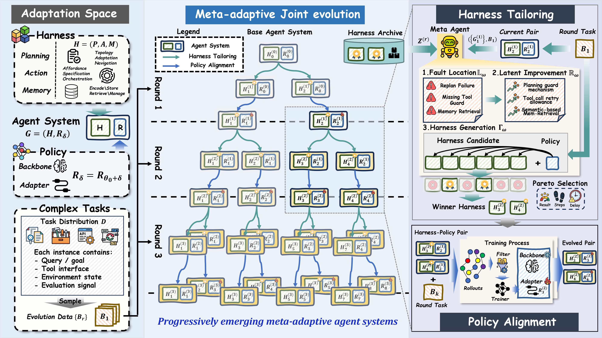

<div align="center">

# HarnessForge: Joint Harness and Policy Evolution for Adaptive Agent Systems

[](https://www.python.org/)
<!-- Optional: add paper/arXiv/framework links here. -->
<!-- [](https://arxiv.org/) -->


</div>

## Introduction


**HarnessForge** is a framework for adapting LLM agent systems as coupled **harness-policy pairs**. Instead of treating the agent scaffold and the underlying reasoning model as separate knobs, HarnessForge keeps both sides explicit: the harness defines execution structure, tool orchestration, memory, and verification behavior, while the policy provides the reasoning behavior that must operate inside that structure.

The workflow has two complementary loops. **Harness tailoring** diagnoses failures from trajectories and generates improved harnesses; **policy alignment** cleans rollout data from those harnesses and prepares SFT-ready training data. This repository contains the generated harnesses, curated harness-policy pairs, production prompts, benchmark runners, and data utilities used for the Qwen3-4B and Qwen3-8B experiments across ToolHop, HotpotQA, 2WikiQA, TMDB, and API-Bank.

## Repository Structure

```text
HarnessForge/
|-- README.md
|-- LlamaFactory/                   # shared training toolkit copy; no bundled datasets or weights
|-- eval_bench/                     # shared local benchmark wrappers/assets
|-- HarnessForge_4B/
|   |-- README.md
|   |-- run_infer.py                    # unified benchmark runner
|   |-- run_tooluse_suite.sh            # ToolHop/TMDB/API-Bank suite wrapper
|   |-- evolved_pairs/                  # curated round-3 harness-policy pairs
|   |   |-- README.md
|   |   |-- pairs.yaml
|   |   |-- harness_factory/            # selected generated harness bundles
|   |   `-- policy_factory/             # lightweight policy manifests
|   |-- harness_factory/                # all importable harness candidates
|   |   |-- base_harness/
|   |   `-- rounds/
|   |-- harness_production/             # API-driven harness tailoring prompts/scripts
|   |   |-- 01_module_localization.yaml
|   |   |-- 02_improvement_directions.yaml
|   |   |-- 03_harness_generation.yaml
|   |   `-- run_harness_production.py
|   |-- runtime/                        # benchmark runtime adapters
|   |-- tools/                          # data cleaning, split, SFT utilities
|   |-- registries/                     # harness/model registries
|   |-- data/                           # optional local data/manifests
|   `-- storage/, output/               # local-only runtime artifacts
`-- HarnessForge_8B/
    |-- README.md
    |-- run_infer.py
    |-- run_tooluse_suite.sh
    |-- evolved_pairs/
    |-- harness_factory/
    |-- harness_production/
    |-- runtime/
    |-- tools/
    |-- registries/
    |-- data/
    `-- storage/, output/
```

The 4B and 8B workspaces are intentionally separated for now. Their generated harnesses, model names, rollout histories, and selected harness-policy pairs differ, so separate folders make reproduction clearer and reduce accidental cross-use.

## 🌎 Setup

### 1. Environment Setup 🛠️

```bash
git clone <this-repo-url>
cd HarnessForge/HarnessForge_4B   # or HarnessForge_8B

conda create -n harnessforge python=3.10 -y
conda activate harnessforge
python -m pip install -U pip setuptools wheel
python -m pip install -r requirements.txt
cp .env.example .env
```

This environment is for harness inference, evaluation, data cleaning, and archive/tailoring scripts.

### 2. Training Dependencies (Optional) 🧪

If you plan to run harness-conditioned SFT or preference optimization, this repo relies on the **[LLaMA-Factory](https://github.com/hiyouga/LLaMA-Factory)** ecosystem. Please follow LLaMA-Factory's official installation instructions for CUDA, PyTorch, vLLM, and efficient fine-tuning dependencies.

The shared `LlamaFactory/` directory at the repository root is kept separate from the 4B/8B HarnessForge workspaces and does not bundle training datasets, model weights, or checkpoints. Current LLaMA-Factory releases require Python 3.11+, so use a separate training environment:

```bash
conda create -n harnessforge-train python=3.11 -y
conda activate harnessforge-train

cd ../LlamaFactory
python -m pip install -U pip setuptools wheel
python -m pip install -e .
```

### 3. Configure Environment Variables 🔑

Fill only the variables required by the benchmark you run:

```bash
OPENAI_BASE_URL=<OPENAI_COMPATIBLE_BASE_URL>
OPENAI_API_KEY=EMPTY
PLANNING_MODEL=<served-model-name>
EXECUTE_MODEL=<served-model-name>
JUDGE_MODEL=<optional-judge-model-name>
```

For local vLLM or another OpenAI-compatible server, `OPENAI_API_KEY=EMPTY` is usually sufficient.

Memory providers that use semantic retrieval follow the standard SentenceTransformers cache behavior. To control where embedding models are cached, set `SENTENCE_TRANSFORMERS_HOME` or `HF_HOME`.

## Benchmark Configuration

- **ToolHop**: local/offline in this workspace. No external benchmark key is required.
- **API-Bank**: local/offline. No external API-Bank key is required. If assets are moved, set:

```bash
API_BANK_APIS_DIR=$PWD/../eval_bench/api-bank/apis
API_BANK_DATABASE_DIR=$PWD/../eval_bench/api-bank/init_database
```

- **RestBench-TMDB**: endpoint-selection mode can run offline. Live TMDB execution requires either:

```bash
TMDB_ACCESS_TOKEN=<tmdb-v4-read-access-token>
# or
TMDB_API_KEY=<tmdb-v3-api-key>
```

Get TMDB credentials from the TMDB account API settings page: https://www.themoviedb.org/settings/api

- **SearchQA / EnvScaler / MixedData**: only configure these when running the corresponding full local assets:

```bash
MIXED_SEARCHQA_RETRIEVE_DIR=/path/to/searchqa/retrieve_data
MIXED_ENVSCALER_ROOT=/path/to/EnvScaler/interact_with_env
MIXED_ENVSCALER_ENVS_PATH=/path/to/envs.json
```

`SERPER_API_KEY` and `JINA_API_KEY` are not required for the default evolved-pair reproduction commands.

## Inference

### Launch vLLM Server Optional

If you want to load a local checkpoint for generation and inference, launch an OpenAI-compatible API server with vLLM. Install vLLM in a separate serving environment that matches your CUDA/PyTorch stack; it is not included in `requirements.txt`.

```bash
python -m vllm.entrypoints.openai.api_server \
  --model /path/to/your/saved/checkpoint \
  --served-model-name your-model-name \
  --port 8001 \
  --trust-remote-code \
  --gpu-memory-utilization 0.9 \
  --max-model-len 30000 \
  --dtype bfloat16
```

Then point HarnessForge to the served endpoint:

```bash
export OPENAI_BASE_URL=http://127.0.0.1:8001/v1
export OPENAI_API_KEY=EMPTY
```

Use the `--served-model-name` value as `--model` in `run_infer.py` or `run_tooluse_suite.sh`.

## Reproduce With Generated Harness-Policy Pairs

The curated pairs are stored under each workspace:

```text
HarnessForge_4B/evolved_pairs/
HarnessForge_8B/evolved_pairs/
```

Each `evolved_pairs/` folder contains a benchmark-to-pair manifest, selected harness bundles, and policy manifests. Large model checkpoints are intentionally not committed; serve the named policy through your OpenAI-compatible endpoint.

### 4B Example

```bash
cd HarnessForge_4B
export OPENAI_BASE_URL=<OPENAI_COMPATIBLE_BASE_URL>
export OPENAI_API_KEY=${OPENAI_API_KEY:-EMPTY}

python ./run_infer.py \
  --benchmark toolhop \
  --infile test \
  --harness_package evolved_pairs.harness_factory \
  --harness rounds.round_03_01.harness_round03_01_5 \
  --model qwen3-4B-round_03_01-harness5 \
  --model-backend local \
  --api-base "$OPENAI_BASE_URL" \
  --api-key "$OPENAI_API_KEY" \
  --concurrency 1 \
  --max_steps 50 \
  --direct_output_dir output/reproduce/evolved_pairs_4b_toolhop \
  --memory_storage_dir storage/reproduce/evolved_pairs_4b_toolhop
```

### 8B Example

```bash
cd HarnessForge_8B
export OPENAI_BASE_URL=<OPENAI_COMPATIBLE_BASE_URL>
export OPENAI_API_KEY=${OPENAI_API_KEY:-EMPTY}

python ./run_infer.py \
  --benchmark toolhop \
  --infile test \
  --harness_package evolved_pairs.harness_factory \
  --harness rounds.round_03_01.harness_round03_01_5 \
  --model qwen3-8B-round_03_01-harness5 \
  --model-backend local \
  --api-base "$OPENAI_BASE_URL" \
  --api-key "$OPENAI_API_KEY" \
  --concurrency 1 \
  --max_steps 50 \
  --direct_output_dir output/reproduce/evolved_pairs_8b_toolhop \
  --memory_storage_dir storage/reproduce/evolved_pairs_8b_toolhop
```

Other benchmark aliases include `toolhop`, `searchqa_hotpotqa`, `searchqa_2wikimultihopqa`, `restbench_tmdb`, and `api_bank`. See each `evolved_pairs/README.md` for the recommended pair per benchmark.

## Harness Tailoring

Harness tailoring is the structure-side evolution loop. Run these commands inside one workspace, for example `HarnessForge_4B/`. The staged runner writes reports to `harness_production/<round_id>/`; generated candidates are written to `harness_factory/rounds/<target_round>/<candidate_name>/` when `--write-candidate` is used.

Set one default meta-agent model or stage-specific models:

```bash
HARNESS_PRODUCTION_MODEL=<default-production-model>
HARNESS_ANALYSIS_MODEL=<stage1-location-model>
HARNESS_DIRECTION_MODEL=<stage2-improvement-model>
HARNESS_GENERATION_MODEL=<stage3-generation-model>
HARNESS_ARCHIVE_MODEL=<archive-summary-model>
```

### Step 1: Location

Localize rollout failures to planning, action, memory, builder, or interface ownership.

```bash
python harness_production/run_harness_production.py \
  --stage stage1 \
  --round-id round3_4 \
  --winner-harness-name harness_round03_04_1 \
  --winner-harness-path harness_factory/rounds/round_03_04/harness_round03_04_1 \
  --metrics-summary-file path/to/metrics_summary.md \
  --failure-trajectory-samples-file path/to/failed_samples.md \
  --success-trajectory-samples-file path/to/success_samples.md
```

Main output: `harness_production/round3_4/module_localization_report.md`.

### Step 2: Improvement

Turn the localization report into an archive-guided module repair brief.

```bash
python harness_production/run_harness_production.py \
  --stage stage2 \
  --round-id round3_4 \
  --winner-harness-name harness_round03_04_1 \
  --winner-harness-path harness_factory/rounds/round_03_04/harness_round03_04_1 \
  --module-localization-report-file harness_production/round3_4/module_localization_report.md \
  --harness-pool-overview-file registries/harness_archive.yaml
```

Main output: `harness_production/round3_4/improvement_direction_brief.md`.

### Step 3: Generation

Generate one self-contained candidate harness from the diagnosis and improvement brief.

```bash
python harness_production/run_harness_production.py \
  --stage stage3 \
  --round-id round3_4 \
  --winner-harness-name harness_round03_04_1 \
  --winner-harness-path harness_factory/rounds/round_03_04/harness_round03_04_1 \
  --module-localization-report-file harness_production/round3_4/module_localization_report.md \
  --improvement-direction-brief-file harness_production/round3_4/improvement_direction_brief.md \
  --example-path harness_factory/rounds/round_03_04/harness_round03_04_1 \
  --target-round round_03_05 \
  --candidate-name harness_round03_05_1 \
  --write-candidate
```

Main output: `harness_factory/rounds/round_03_05/harness_round03_05_1/`.

### Step 4: Validation

Run the bounded smoke-test/repair loop before spending rollout budget.

```bash
python harness_production/04_validation_retry.py \
  --candidate-path harness_factory/rounds/round_03_05/harness_round03_05_1 \
  --harness-package harness_factory \
  --max-fix-attempts 3
```

### Step 5: Filter And Update

Evaluate valid candidates with `run_infer.py` or `run_tooluse_suite.sh` while recording `registries/harness_pool.yaml`; then apply Pareto-style half-selection and update the compact archive used by future improvement prompts.

```bash
python tools/half_select_harnesses.py \
  --registry-file registries/harness_pool.yaml \
  --round round3_4 \
  --dataset mixeddata_val \
  --output harness_production/round3_4/half_selection.json

python tools/update_harness_archive_from_design.py \
  --archive-file registries/harness_archive.yaml \
  --harness-name harness_round03_05_1 \
  --harness-path harness_factory/rounds/round_03_05/harness_round03_05_1 \
  --model "$HARNESS_ARCHIVE_MODEL" \
  --archive-tier survivor \
  --tag survivor
```

`tools/update_harness_archive_from_design.py` reads `Description.md`, `builder.py`, and module providers, asks an OpenAI-compatible model for a compact public archive entry, and writes it back to `registries/harness_archive.yaml` without timestamps or raw trajectories.

## Policy Alignment

Policy alignment is the reasoner-side loop after harness tailoring. It reuses successful rollouts from selected harnesses and turns them into harness-conditioned SFT data; raw rollouts, cleaned datasets, and checkpoints should stay local or be released as separate artifacts.

### Step 1: Collect Survivor Rollouts

Run the selected harness-policy pair and keep the output directory fixed for trace cleaning.

```bash
python ./run_infer.py \
  --benchmark toolhop \
  --infile test \
  --harness_package harness_factory \
  --harness rounds.round_03_05.harness_round03_05_1 \
  --model qwen3-4B-round_03_05-harness1 \
  --model-backend local \
  --api-base "$OPENAI_BASE_URL" \
  --api-key "$OPENAI_API_KEY" \
  --concurrency 1 \
  --max_steps 50 \
  --direct_output_dir output/policy_alignment/round03_05_harness1 \
  --memory_storage_dir storage/policy_alignment/round03_05_harness1
```

### Step 2: Curate Successful Trajectories

Use rejection-style filtering to keep successful, well-formed trajectories.

```bash
python tools/prepare_toolhop_rollout_sft.py \
  --input output/policy_alignment/round03_05_harness1/results.jsonl \
  --output-dir data/sft/round03_05_harness1_toolhop
```

### Step 3: Build Trainer Data

Package cleaned actor/candidate trajectories into a trainer-facing bundle.

```bash
python tools/prepare_trainer_harness_data.py \
  --actor-files output/policy_alignment/round03_05_harness1/results.jsonl \
  --candidate-files output/policy_alignment/round03_05_harness1/results.jsonl \
  --output-dir data/sft/round03_05_harness1_trainer_bundle
```

### Step 4: Train Adapter

Pass the generated bundle to your SFT stack, such as LLaMA-Factory or an internal trainer. Run this from the external training environment described in Setup, not from the lightweight HarnessForge inference environment.

```bash
cd ../LlamaFactory
conda activate harnessforge-train
llamafactory-cli train /path/to/harness_conditioned_sft.yaml
```

## Acknowledgments

This repo builds upon and adapts code from:

- **[LLaMA-Factory](https://github.com/hiyouga/LLaMA-Factory)** - training ecosystem for SFT and preference optimization.
